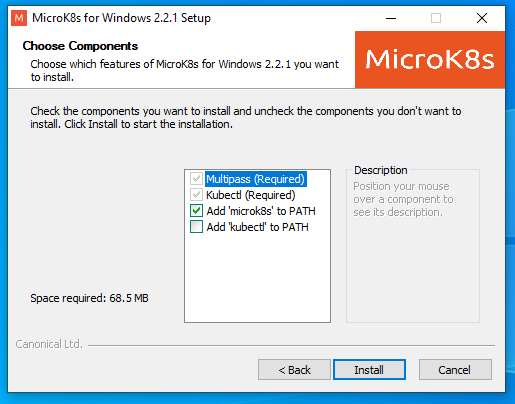
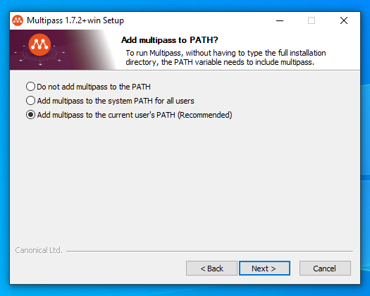
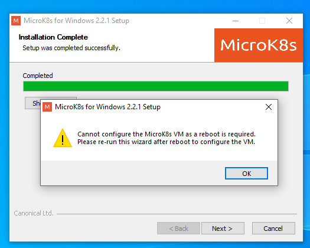
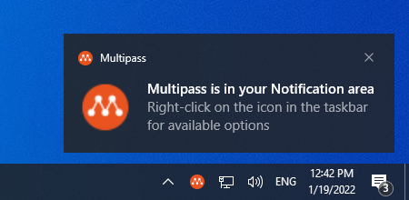
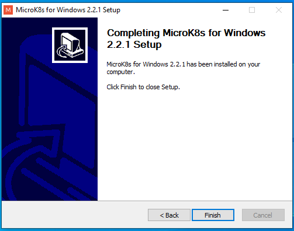
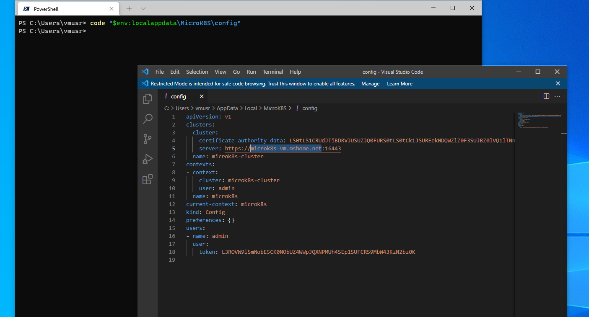

# MicroK8s setup

For any unresolved issues, check official github repository: https://github.com/ubuntu/microk8s/issues

## Install MicroK8s

### Ubuntu

1. Install via snap:
   ```
   sudo snap install microk8s --classic
   ```
2. Configure Ubuntu ufw firewall settings:
   ```
   sudo ufw allow in on cni0
   sudo ufw allow out on cni0
   sudo ufw default allow routed
   ```
3. Add current user to microk8s user group so can invoke command without sudo:
   ```
   sudo usermod -a -G microk8s ${USER}
   sudo chown -f -R ${USER} ~/.kube
   ```
   Reboot for it took effect.


### Windows

MicroK8S installer download URL: https://microk8s.io/microk8s-installer.exe

On Windows, MicroK8s can be run on **Hyper-V** based VM or **VirtualBox**. Both of these requires at least 4GB free RAM & 50GB free disk spaces available.

Recommend to install *[Windows Terminal](https://docs.microsoft.com/en-us/windows/terminal/)* & *[PowerShell v7.2 or above](https://docs.microsoft.com/en-us/powershell/scripting/install/installing-powershell-on-windows)* for better CLI experience.

The fastest way is to install those tools are by "[winget](https://docs.microsoft.com/en-us/windows/package-manager/winget/)" command lines:
```
winget install --id Microsoft.PowerShell
winget install --id Microsoft.WindowsTerminal
```

#### Hyper-V installation 

##### Installation:

1. Run MicroK8S installer, check Add 'microk8s' to PATH, click Install:
   
2. It will prompt to **Multipass** install wizard, click Next to install:
   
3. Select Microsoft Hyper-V, then click Next:
   
4. Select Add multipass to the current user's PATH:
   
5. During installation it may show that it needs to reboot to take effect, just click OK:
   
6. Select Reboot now for restarting Windows to enable Hyper-V:
   
7. After reboot, the Multipass tray icon should show it is successfully started:
   
8. Run the installer again, check Add 'microk8s' to PATH, click Install:
   
9. It will prompt to configure microK8S VM, click Yes:
   
10. Click Next to accept default VM creation spec:
   
   Then wait for Linux VM and MicroK8S instance downloading & installation:
   
   Finally, the installer will show MicroK8s for Windows installation completed:
   
   We can start using it on command line window, for example, type `microk8s status --wait-ready` to check server running status:
   

##### Configuration:
* Set stable hostname of Hyper-V VM:
By default, Hypver-V VM's NAT network IP address would change after each time host reboot, according to [this](https://github.com/ubuntu/microk8s/issues/22#issuecomment-884059245), we can set MicroK8s config file to use hostname instead of IP address to avoid connect failure:

    1. Login into the MicroK8S VM by:
       ```
       multipass shell microk8s-vm
       ```
    2. Edit `/var/snap/microk8s/current/certs/csr.conf.template` configuration file (needs to use **sudo** to edit), add new DNS entries like following:
       ```
       DNS.6 = microk8s-vm.mshome.net
       ```
    3. Restart K8s service:
       ```
       sudo microk8s.stop; sudo microk8s.start
       ```
       
    4. Exit MicroK8S VM shell by type `exit`.
    5. Modify the configuration file `%LOCALAPPDATA%\MicroK8S\config` on Windows Host side, like following PowerShell command to open that file in Visual Studio Code:
       ```
       code "$env:localappdata\MicroK8S\config"
       ```
       Replace line 5 `https://[private IPv4 address]:16443`'s IP address with domain name **microk8s-vm.mshome.net** as:
       ```yaml
       server: https://microk8s-vm.mshome.net:16443
       ```
       
       

