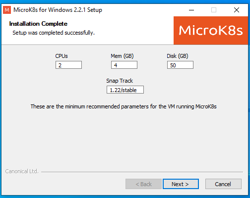
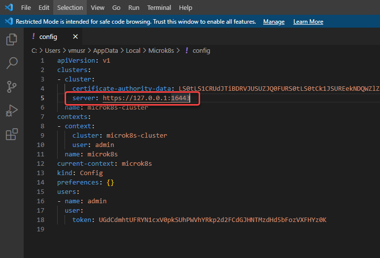

# MicroK8s setup

{: .no_toc }

<details open markdown="block">
  <summary>
    Table of contents
  </summary>
  {: .text-delta }
1. TOC
{:toc}
</details>


For any unresolved issues, check official github repository: [https://github.com/ubuntu/microk8s/issues](https://github.com/ubuntu/microk8s/issues)

## Install MicroK8s

### macOS

Install [homebrew](https://brew.sh/), then follow the [official document](https://microk8s.io/docs/install-alternatives#heading--macos) to install microk8s.

if you have issue to start *microk8s-vm* VM instance, try to [turn off VPN  installed on host OS](https://github.com/canonical/microk8s/issues/1287#issuecomment-707208977), or [try to run `microk8s uninstall` first, reboot host machine then run `microk8s install` again](https://github.com/canonical/microk8s/issues/1313#issuecomment-644217384).


### Ubuntu Linux

1. Install via snap:
   ```
   sudo snap install microk8s --classic
   ```
2. Configure Ubuntu ufw firewall settings:
   ```
   sudo ufw allow in on cni0
   sudo ufw allow out on cni0
   sudo ufw default allow routed
   ```
3. Add current user to microk8s user group so can invoke command without sudo:
   ```
   sudo usermod -a -G microk8s ${USER}
   sudo chown -f -R ${USER} ~/.kube
   ```
   Reboot for it took effect.

### Windows

MicroK8S installer download URL: [https://microk8s.io/microk8s-installer.exe](https://microk8s.io/microk8s-installer.exe)

On Windows, MicroK8s can be run on **Hyper-V** based VM or **VirtualBox** based VM. Both of these requires at least 4GB free RAM & 50GB free disk spaces available. On Windows 10/11 Home Edition, you must using VirtualBox approach since Hyper-V is not available on that SKU.

Recommend to install

* [Windows Terminal](https://docs.microsoft.com/en-us/windows/terminal/)
* [PowerShell v7.2 or above](https://docs.microsoft.com/en-us/powershell/scripting/install/installing-powershell-on-windows)
* [gsudo](https://gerardog.github.io/gsudo/)

for better CLI experience.

The fastest way is to install those tools are by "[winget](https://docs.microsoft.com/en-us/windows/package-manager/winget/)" command lines:
```
winget install --id Microsoft.PowerShell
winget install --id Microsoft.WindowsTerminal
```

**Note:**

If your system drive (C:) is less than 50GB free space, you can create symbolic link in PowerShell with Administrator permission, so redirect various configuration and VM image files of multipass saving to another disk drive, for example, the following command make those files save to `D:\multipassd` folder:  
(**Note**: you have to create target empty folder `D:\multipassd` before running this command.)
```
gsudo New-Item -ItemType SymbolicLink -Path "C:\Windows\System32\config\systemprofile\AppData\Roaming\multipassd\" -Target "D:\multipassd\"
```

#### Hyper-V installation 

**Note:**

If your system drive (C:) available free space is limited, you can [manually install Hyper-V](https://docs.microsoft.com/en-us/virtualization/hyper-v-on-windows/quick-start/enable-hyper-v) first, then open Hyper-V manager to set both **Virtual Hard Disks** and **Virtual Machines** configuration files to another drive:


##### Installation

1. Run MicroK8S installer, check `Add 'microk8s' to PATH`, click Install:  
   
2. It will prompt to **Multipass** install wizard, click Next to install:  
   
3. Select Microsoft Hyper-V, then click Next:  
   
4. Select Add multipass to the current user's PATH:  
   
5. During installation it may show that it needs to reboot to take effect, just click OK:  
   
6. Select Reboot now for restarting Windows to enable Hyper-V:  
   
7. After reboot, the Multipass tray icon should show it is successfully started:  
   
8. Run the installer again, check Add 'microk8s' to PATH, click Install:  
   
9. It will prompt to configure microK8S VM, click Yes:  
   
10. Click Next to accept default VM creation configuration:  
     
   Then wait for Linux VM and MicroK8S instance downloading & installation:  
     
   Finally, the installer will show MicroK8s for Windows installation completed:  
     
   We can start using **microk8s** on command line window, for example, `microk8s status --wait-ready` to check running status:  
   

##### Configuration
* Set stable hostname of Hyper-V VM:  
By default, Hypver-V VM's NAT network IP address would change after each time host reboot, So you will unable to use kubectl cli tool of MicroK8s after host computer reboot:   
  
According to [this GitHub issue](https://github.com/ubuntu/microk8s/issues/2452#issuecomment-884059245), we can set MicroK8s config file to use hostname instead of IP address to avoid kubectl connection failure:

    1. Login into the MicroK8S VM by:
       ```
       multipass shell microk8s-vm
       ```
    2. Edit `/var/snap/microk8s/current/certs/csr.conf.template` configuration file (needs to use **sudo** to edit), add new DNS entries like following:
       ```
       DNS.6 = microk8s-vm.mshome.net
       ```
       
    3. Restart K8s service:
       ```
       sudo microk8s.stop; sudo microk8s.start
       ```
       
    4. Exit MicroK8S VM shell by type `exit`.
    5. Modify MicorK8s configuration file `%LOCALAPPDATA%\MicroK8S\config` on Windows Host side, like following PowerShell command to open that file in Visual Studio Code:
       ```
       code "$env:localappdata\MicroK8S\config"
       ```
       Replace line 5 `https://[private IPv4 address]:16443`'s IP address with domain name **microk8s-vm.mshome.net** as:
       ```yaml
       server: https://microk8s-vm.mshome.net:16443
       ```
       
       
#### VirtualBox installation 

##### Prerequisite

You have to install [VirtualBox](https://www.virtualbox.org/) & [Mulitpass](https://multipass.run/) ***manually***, Choose VirtualBox as underlying Hypervisor And Reboot Windows, Run Mulitpass's "**Open Shell**" command before run MicroK8S installer, then the installer will be able to start MicroK8s VM correctly.

The most straightforward way to install is by "[winget](https://docs.microsoft.com/en-us/windows/package-manager/winget/)" command line:

1. Install VirtualBox:
   ```
   winget install --id Oracle.VirtualBox
   ```
   
2. Install Multipass, be sure to add last `-i` argument for interactive installation:
   ```
   winget install --id Canonical.Multipass -i
   ```
   During installation wizard, be sure to choose Oracle VirtualBox when ask which Hypervisor to use:  
   
   Be sure to select **Add multipass to the current user's PATH** option in following install wizard page:  
   
3. Reboot Windows for VirtualBox's virtual hardware driver took effect.
4. Start Multipass application from start menu (Or it has already been auto started by default installation configuration, Right Click then select "**Open Shell**" from its tray icon:  
   
5. Wait for PowerShell window doing 1st time preparation of primary VM of Multipass downloading VM image:  
     
   When its done, PowerShell Window will show a Linux Bash has success login status, And the tray icon will show "primary" VM is running, which means Multipass has installed successfully:
   
    
##### Installation

1. Run MicroK8S installer, check Add 'microk8s' to PATH, click Install:  
   
2. Click Yes to start preparing MicroK8s VM:  
   
3. Click Next to accept default VM creation configuration:  
   
4. Wait for MicroK8s VM downloading & preparation:  
     
   Finally, the installer will show MicroK8s for Windows installation completed:  
     
   We can start using **microk8s** on command line window, for example, `microk8s status --wait-ready` to check running status:  
   

##### Configuration

Because the limitation of VirtualBox's NAT virtual network adapter, to use [microk8s kubectl](https://microk8s.io/docs/working-with-kubectl) command, you need to add port mapping to redirect port to host computer:

1. Install [gsudo](https://gerardog.github.io/gsudo/)
2. Open VirtualBox manager GUI as [*LocalSystem* Account](https://docs.microsoft.com/en-us/windows/win32/services/localsystem-account) by command:
   ```powershell
   gsudo -s '& "$env:VBOX_MSI_INSTALL_PATH\VirtualBox.exe"'
   ```
   Add **16643** port forwarding of NAT network adapter 1 of microk8s-vm to host computer:    
   Or you can use following command to do it at once without leaving CLI windows:
   ```powershell
   sudo -s '& "$env:VBOX_MSI_INSTALL_PATH\VBoxManage.exe" controlvm microk8s-vm natpf1 "kubectl_port, tcp,,16443,,16443"'
   ```
3. Modify MicorK8s configuration file `%LOCALAPPDATA%\MicroK8S\config` on Windows Host side, like following PowerShell command to open that file in Visual Studio Code:
    ```
    code "$env:localappdata\MicroK8S\config"
    ```  
    Replace line 5 `https://[private IPv4 address]:16443`'s IP address with **127.0.0.1** like following:  
    ```yaml
    server: https://127.0.0.1:16443
    ```
    

Some other configuration notices can be found on [official document](https://multipass.run/docs/using-virtualbox-in-multipass-windows).

